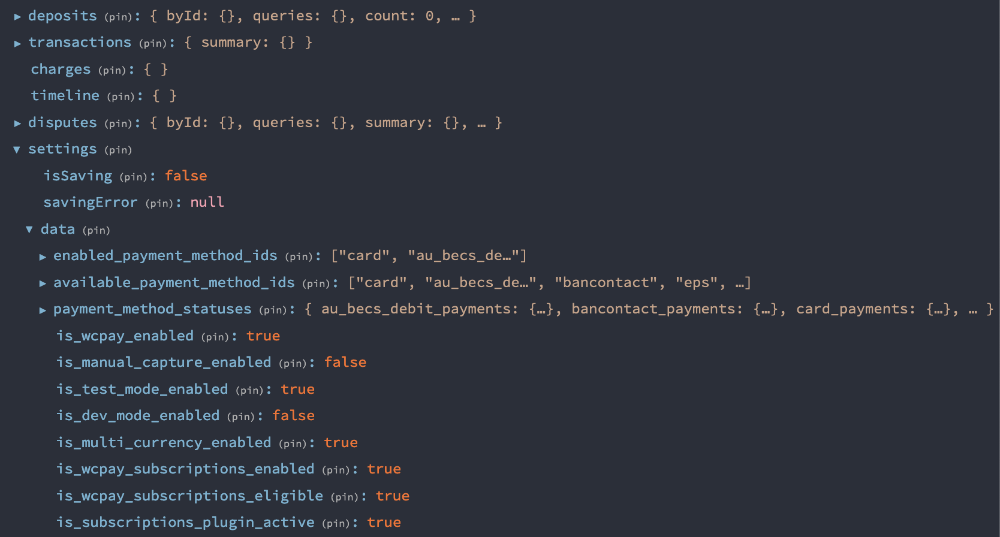
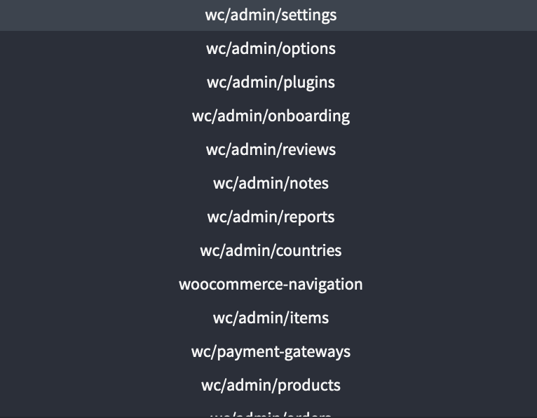

<style>
:root {
  font-family: system-ui, sans-serif;
  /* font-weight: 600; */
  letter-spacing: 0.03em;
}
pre {
  padding: 2em 3em;
}

strong {
  color: #56ddef;
}
  </style>

## `@wordpress/data` 🤔

---

1. What is `@wordpress/data` and when it is useful?
1. Terminology.
1. Demo of @aprea’s TicTacToe app using `@wordpress/data` for state management.
1. How do I?

---

## Local vs Global State

- **Local state**
  state of a single component and children.

- **Global/Application state**
  Lives outside of the component tree.
  Individual components interact with the state.

---

Sharing **local state** across components is difficult and requires a lot of “prop drilling”.

**Global state** makes it easier for individual components to share a “single source of truth”.

<!-- Note that we can and typically will use both local and global state. -->

---

`@wordpress/data` is a form of “Global/Application” state, designed to meet the needs of both WordPress and plugins.

Built upon and shares core principles of Redux.

---

## Principles

- Single source of truth.
- State shape and logic are explicitly defined.
- State is read-only.
  - You don’t mutate the state directly.
  - You call _actions_ that describe a state transformation.

---

# Terminology

---

### Store

A [**store**]() holds the whole state tree of your application.

The only way to change the state inside it is to dispatch an action on it.

---



---

### Store

`@wordpress/data` differs slightly from the Redux approach of having only one store for a single application.

Multiple stores are used within wp-admin, each represented by a namespace: (e.g. `wc/payments` or `core/blocks`).

---



---

### Selector

A [**selector**]() is a function that will get and return a specific slice of state based on arguments provided.

```js
// Selector
export const getProducts( state ) => {
  return state.products;
}

// Selector with args
export const getProduct( state, id ) => {
  return state.products[ id ];
}
```

---

### Action

- An [**action**]() is a plain object representing an intention to change the state.

- Actions are [**dispatched**]() to the [**reducer**]() when we want to make a change to the state.

```js
// Action object
{
  type: 'SET_PRODUCT',
  data: { id: 123, title: 'Product Title' }
}
```

---

[**Action types**]() are often split into separate files.
(e.g. `action-types.js`):

```js
// action-types.js
const TYPES = {
  ADD_POST: 'ADD_POST',
  UPDATE_POST: 'UPDATE_POST',
  DELETE_POST: 'DELETE_POST',
}
export default TYPES
```

---

[**Action creators**]() are functions that return an **action** object that will be dispatched to the **reducer**.

```js
// Action creator
export const addPost = (post) => {
  return {
    type: TYPES.ADD_POST, // "ADD_POST"
    data: post,
  }
}
```

---

### Reducer

A [**reducer**](https://redux.js.org/tutorials/fundamentals/part-3-state-actions-reducers) is a pure function that accepts the previous `state` and an `action` as arguments and returns an updated `state` value.

---

### Reducer

```js
export const reducer = (state, action) => {
  if (action.type === 'SET_PRODUCT') {
    const { product } = action.data
    const existingProducts = state.products.filter(
      (existing) => existing.id !== action.data.product.id
    )
    return {
      ...state,
      products: [...existingProducts, product],
    }
  }
}
```

---

### Reducer

- It must be a pure function. ⛔️ No side-effects.
- It must never mutate the incoming state. Return a newly updated state object.

  ```js
  return { ...state, ...newState }
  ```

---

### Basic flow

**Action** 👉 **Reducer** 👉 **New State** 👉 **Selector**

---

### Control

A [**control**]() or [**control function**]() defines the execution flow for a specific action type.

Used when you want to execute logic as part of the flow of modifying state.

For example, **async** data flows like REST API requests.

---

```js
// Control object containing one or more control functions
export default {
  // Control function
  FETCH: async ({ path, options }) => {
    const response = await window.fetch(path, options)
    const result = await response.json()
    return result
  },
}
```

---

A **control action creator** is the same as an action creator, returning an **action** that has a type matching a **control function**.

---

```js
// Control action creator
export const fetch = (path, options = {}) => {
  return {
    type: 'FETCH',
    path,
    options,
  }
}
```

---

### Resolver

Linked to a **selector**, **resolvers** allow for automatically resolving data for the initial slice of state the selector is retrieving.

---

```js
import { fetch } from './controls'
import { setPlayer } from './actions'

// Resolver
// The getPlayer selector will automatically call this resolver
export function* getPlayer(playerId) {
  const player = yield fetch(`/api/players/${playerId}`)

  if (player) {
    return setPlayer(player)
  }

  return
}
```

---

Resolvers allow us to listen for resolution changes (e.g. a fetch request in progress) and update the UI accordingly.

🙌 Plus we get the benefit of caching the data for subsequent requests.

---

- The name of a resolver function must be the same as the selector that it is resolving.
- Resolvers must return, dispatch or yield action objects.

---

### Async flow

**Selector** 👉 **Resolver** 👉 **Control** 👉 **Action** 👉 **Reducer** 👉 _(Wait for resolution)_ 👉 **New State** 👉 **Selector**

With a few more cycles in between for updating resolution state.
